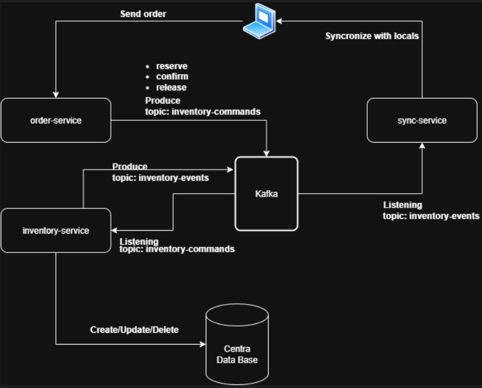

# Optimización de un Sistema Distribuido de Inventario

Propusimos y prototipamos una arquitectura basada en **microservicios** con **event streaming (Kafka)** y un **patrón de reserva/confirmación** para evitar sobre‑ventas. El **Inventory Service** mantiene la verdad del stock (consistencia fuerte en operaciones críticas), el **Order Service** orquesta el ciclo de vida del pedido y la reserva, y el **Sync Service** simula la sincronización de tiendas hacia el centro. Priorizamos **consistencia** sobre disponibilidad para operaciones de stock.

---
## 1) Objetivo y alcance

Diseñar y prototipar una mejora al sistema de inventario distribuido para:

- Reducir **latencia** de actualización de stock.
- Mejorar **consistencia** entre tiendas y sede central.
- Bajar **costos operativos**.

El prototipo incluye tres servicios ejecutables localmente y persistencia simulada (H2/archivos en disco).

---

## 2) Contexto y problemas actuales

- Cada tienda posee una base local que se sincroniza cada ~15 min con el centro → **inconsistencias** y **ventas perdidas**.
- Backend **monolítico** y frontend legado.
- Requisitos piden una arquitectura distribuida con APIs claras y tolerante a fallos, priorizando consistencia **o** disponibilidad (debidamente justificado).

**Dolores**: sobre‑venta por concurrencia, latencia de sincronización, baja trazabilidad de cambios.

---

## 3) Arquitectura propuesta

### 3.1 Diagrama (alto nivel)

### 3.2 Componentes

- **Inventory Service (8082)**: fuente de verdad del stock.
    - Endpoints de **consulta, reserva, confirmación y liberacion**.
    - Mantiene **reservas** con TTL opcional y aplica **decrementos atómicos**.
    - Publica/consume eventos de stock.
- **Order Service (8081)**: orquesta el ciclo de vida del pedido.
    - Crea pedido → solicita **reserva** de ítems → confirma/cancela según pago.
    - Idempotencia por `Idempotency-Key`.
- **Sync Service (8083)**: simula la transferencia de datos hacia las tiendas.
    - El syncronizador escucha los movimienntos de stock dentro del topico inventory-events y los emite como eventos a Kafka para reducir la ventana de 15 min.

### 3.3 Patrones clave

- **Reserva → Confirmación (two‑step commit)** para evitar sobre‑ventas.
- **Event Streaming**: `stock.events` y `order.events` para desacoplar y auditar.

---

## 4) Modelo de consistencia y concurrencia

- **Prioridad: Consistencia** en operaciones críticas (reservar, confirmar/cancelar, ajustar stock).
    - Transacciones locales y **bloqueos optimistas** sobre SKU + constraints de unicidad.
    - **Idempotencia**: operaciones reciben `Idempotency-Key` o `reservationId` para reintentos seguros..
- **Contención**: reservas con **TTL** evitan “stock muerto” si el flujo se interrumpe.

---

## 5) Diseño de APIs (contratos principales)

En la seccion /doc se se agregara una colleccion de Postman que puede ser importada en dicha aplicacion para mayor facilidad a la hora de ejecutar los enpoints descriptos.
### 5.1 Inventory Service (puerto 8082)

|Método|Ruta|Descripción|Body Ejemplo|
|---|---|---|---|
|GET|`/inventory/{storeId}/items/{itemId}`|Consulta el inventario de un SKU|—|
|POST|`/admin/newSKU`|Agrega un nuevo SKU al inventario|`{ "storeId": "S1", "itemId": "SKU-2", "available": 12 }`|

### 5.2 Order Service (puerto 8081)

| Método | Ruta                                          | Descripción                          | Body Ejemplo                                             |
| ------ | --------------------------------------------- | ------------------------------------ | -------------------------------------------------------- |
| POST   | `/inventory/{storeId}/items/{itemId}/reserve` | Reserva stock de un ítem             | `{ "qty": 2 }`                                           |
| POST   | `/inventory/{storeId}/items/{itemId}/confirm` | Confirma la venta de un stock        | `{ "holdId": "H-68d3741d-0273-4075-b3c4-43a3a1d414c0" }` |
| POST   | `/inventory/{storeId}/items/{itemId}/release` | Libera un stock previamente retenido | `{ "holdId": "H-8ff9510e-3737-487a-bea6-09d7972815ad" }` |

### 5.3 Sync Service  (puerto 8083)

| Método | Ruta                        | Descripción                               | Body Ejemplo |
| ------ | --------------------------- | ----------------------------------------- | ------------ |
| GET    | `/state/{storeId}/{itemId}` | Consulta el estado sincronizado de un SKU | —            |

---

## 6) Persistencia y datos

- **Demo** con base de datos **H2**, como base de datos cental.
- Tablas principales en inventory-service: 
	- **hold**
		- Long id
		- String holdId
		- String storeId
		- String itemId
		- int qty
		- Instant expiresAt
		- String status
	- stock
		-  Long id
		- String storeId
		- String itemId
		- int available
		- int reserved
		- long version
	- processed_event
		- String eventId
		- Instant processedAt

- sync-service:
	- En el caso del servicio de sincronizacion este debera actualizar los distinntos locales en base a los eventos que genere. A efectos de esta demo se expone un endpoint para observar una vista del envio de la informacion a los potenciales locales.

---

## 7) Observabilidad y seguridad

- **Logs** estructurados por servicio (archivo por proceso).
- **DLQ** para eventos malformados.
- **Deseable pero no implementado Seguridad**: API Key simple → OAuth2/JWT + mTLS entre servicios.

---

## 8) Pruebas (unitarias + E2E mínima)

- Se agregaron algunos test E2E con el fin de garantizar el correcto funcionamiento de alguno de los enpoint clave como la creacion y consulta del inventario.
- Como mejora se deben proyectar test para la reserva/confirmacion y release, con el fin de automatizar y garantizar un flujo optimo del aplicativo

---

## 9) Decisiones de diseño

1. **Consistencia antes que disponibilidad**: preferimos fallar rápido y mantener consistencia en los datos antes que sobre‑vender o tener inconsitencias de stock. Esto reduce el riesgo de ventas fantasma en las que no hay stock disponible.
2. **Reserva/confirmación** vs decremento directo: el flujo en dos pasos reduce cancelaciones costosas y permite manejo explícito de pagos.
3. **Streaming** vs batch 15 min: los eventos reducen la latencia a segundos y mejoran trazabilidad.
4. **Persistencia simple** (H2/archivos) en demo: foco en diseño; reemplazable por Postgres/MySQL/Oracle en producción.
5. **CQRS liviano**: evita complejidad de event‑sourcing completo; deja abierta la puerta a proyecciones escalables.

---

## 10) Productividad (GenAI & herramientas modernas)

- Uso de **GenAI** para:
    - Esqueleto de controladores, DTOs y tests repetitivos.
    - Generación de **fixtures** y escenarios de concurrencia.
    - Revisión de contratos (nombres, verbos HTTP, códigos de estado).
- **Agentic IDE**: refactors automáticos, templates de logging estructurado.
